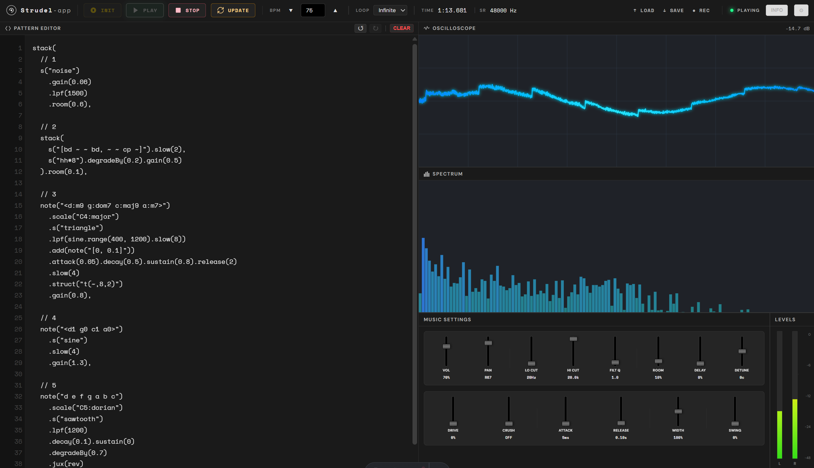

# Strudel-app

[](https://astro.build/)

[](https://www.typescriptlang.org/)
[](https://developer.mozilla.org/en-US/docs/Web/HTML)
[](https://developer.mozilla.org/en-US/docs/Web/CSS)

<br>
<br>

## Table of contents

1. [Overview](#overview)
2. [Quick-Start](#quick-start)

<br>
<br>

## 🎯 Overview

**Strudel-app** is a web application that allows users to create and play music patterns using the Strudel programming language.

<br>
<br>

## 📸 Screenshot



<br>
<br>

## 🏃 Quick-Start
> **Prerequisite:** Ensure you have [Node.js 18+](https://nodejs.org/) and npm installed.

### 1. Installation
#### 1.1 Clone Repository
```bash
git clone git@github.com:cmpnn-romain/Strudel-app.git
```
```bash
cd Strudel-app
```

#### 1.2 Install Dependencies
```bash
npm install
```

### 2. Development
#### 2.1 Start Dev Server
```bash
npm run dev
```
The site will be available at `http://localhost:4321`.

#### 2.2 Preview Production Build
```bash
npm run build
```
```bash
npm run preview
```